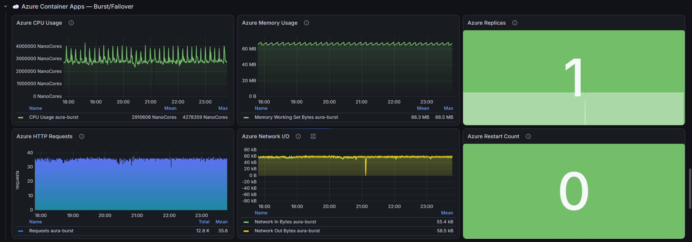
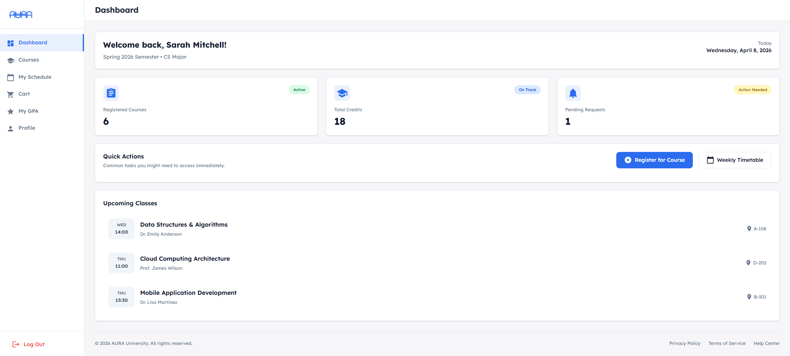
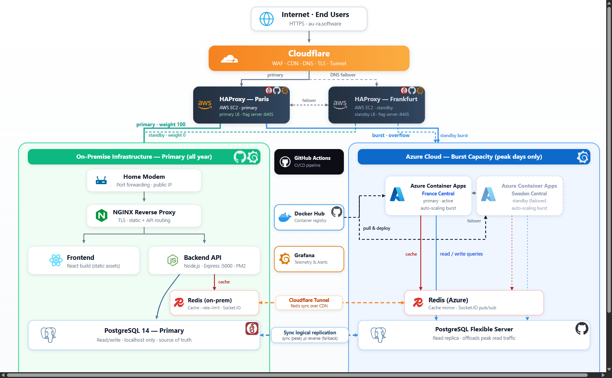
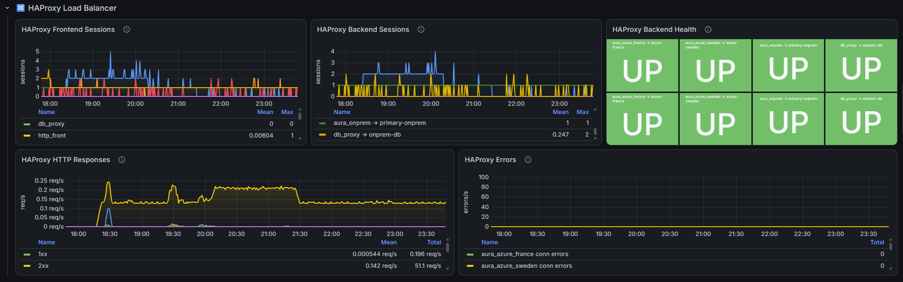
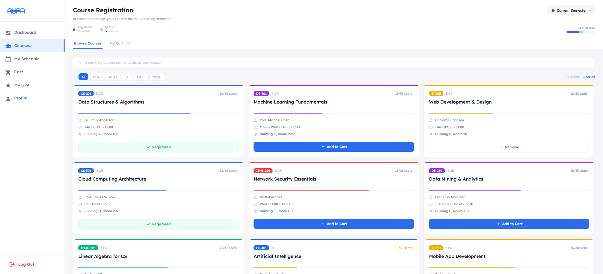
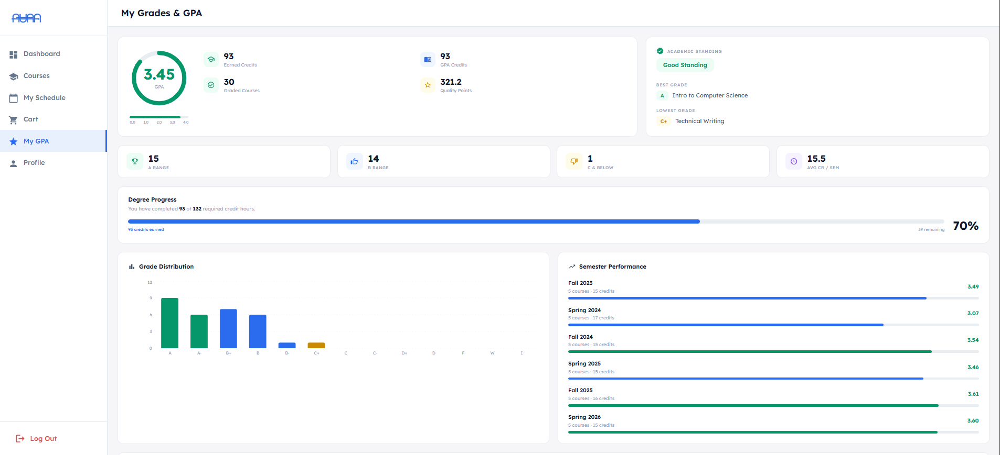

# AURA — Academic University Registration Architecture

**A hybrid-cloud, multi-tenant SaaS platform for university course registration — built as a 4-member graduation project at Zewail City of Science, Technology and Innovation (2025–2026).**

> ⚠️ The source code is private (university team project). This repository documents the architecture and engineering behind it — I'm happy to do a full code walkthrough in an interview.

---

## Headline numbers

| Metric | Value |
|---|---|
| Success rate under load | **99.94%** |
| Requests served in load test | **571,000+** |
| Average response time | **276 ms** |
| Simulated concurrent users (k6) | **3,000** |
| Distributed stress-test capacity | 25 nodes × 200 VUs = **5,000 concurrent users** |
| Load-balancer failover detection | **~45 s** with automatic failback |



---

## What it does

AURA is a multi-tenant university management system serving students, professors, teaching assistants, deans, and administrators:

- Course registration with **real-time seat availability** (Socket.IO WebSockets) and automatic waitlists
- Schedule building with conflict detection and PDF/CSV export
- Grading, transcripts, GPA tracking, and grade-change approval workflows
- Full admin panel, payments, campus-wide analytics
- **Multi-university tenancy** from a single deployment
- JWT authentication with OTP verification, MFA (TOTP), account lockout, and session timeout



---

## The interesting part: hybrid cloud bursting

The platform runs primarily on **self-hosted on-premises servers** and bursts into the cloud only under peak load — SaaS-grade availability without permanent cloud costs.



**Request path:**

```
Client
  → Cloudflare (WAF, CDN, DNS)
  → AWS load balancers — active-standby pair (eu-west-3 primary / eu-central-1 standby)
  → HAProxy (routing + load balancing)
  → On-premises app servers (normal load)
  → Azure Container Apps (overflow burst: France Central tier-1, Sweden Central tier-2)
      → WireGuard VPN tunnels back to the on-prem PostgreSQL primary
```

**Design decisions worth talking about:**

- **Active-standby LB failover:** a symmetric DNS-failover daemon runs on both AWS load balancers, health-checks the peer, and rewrites Cloudflare A records with deterministic failover and automatic failback (~45 s detection). No single point of failure at the edge.
- **Burst threshold:** HAProxy keeps traffic on-premises until a concurrency limit is reached, then diverts new requests to Azure Container Apps — the cloud only costs money during registration peaks.
- **Database consistency across clouds:** burst containers reach the on-prem PostgreSQL primary over WireGuard tunnels; read replicas take read traffic behind HAProxy.
- **Zero-loss switchover:** a documented runbook pauses writes (draining), waits for replication lag to reach zero, promotes the Azure replica, and resumes writes in the cloud — used for planned peak-season migrations.

---

## Load testing & observability

- **k6** stress workflows in GitHub Actions, including a distributed mode (25 runners × 200 VUs)
- **Locust** registration scenarios on Azure Load Testing engines, run in-region (France Central) to measure true system latency without runner bottlenecks
- **Grafana** dashboards for on-prem and Azure burst tiers (CPU, memory, HTTP throughput, replicas, restarts)



---

## Tech stack

| Layer | Technology |
|---|---|
| Frontend | React 19, Vite |
| Backend | Node.js 22, Express 5, Socket.IO |
| Data | PostgreSQL 17 (streaming replication + read replicas), Redis |
| Edge & LB | Cloudflare (WAF/CDN/DNS), HAProxy, Nginx |
| Cloud | AWS EC2 (load balancers), Azure Container Apps (burst tiers) |
| Networking | WireGuard site-to-cloud VPN |
| CI/CD | GitHub Actions (deploy, replica lifecycle, k6 stress, Azure load tests), Docker |
| Observability | Grafana, k6, Locust |
| OS | Ubuntu 22.04 |

---

## Screenshots

| Registration | Grades |
|---|---|
|  |  |

---

## Team

Built by a 4-member Agile team at Zewail City, supervised by Dr. Yousry Abdul-Azeem.
My focus areas: backend REST APIs and authentication/security (JWT, OTP, RBAC, rate limiting), the hybrid-cloud infrastructure (AWS load balancers, HAProxy, Azure burst, WireGuard, PostgreSQL replication), and CI/CD automation.

**Contact:** mabdeltawab933@gmail.com · [LinkedIn](https://www.linkedin.com/in/mahmoud-abdeltawab-dev) · [GitHub](https://github.com/Mahm0udAbdeltawab)
